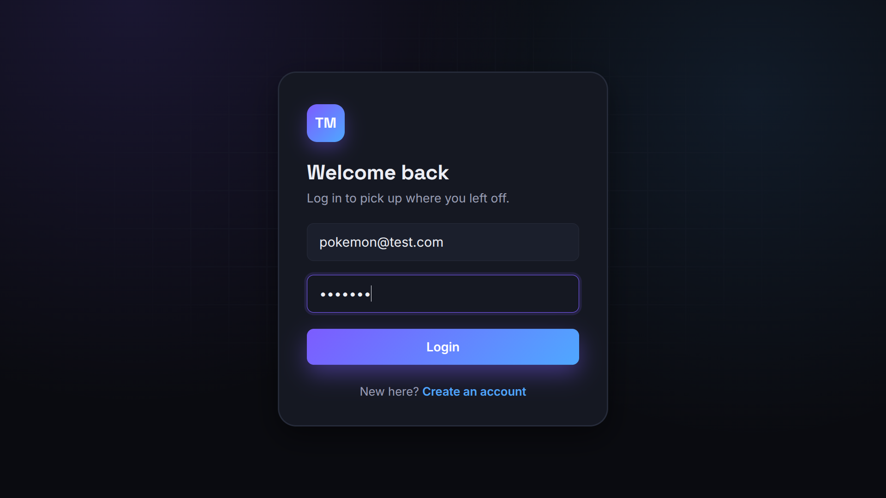
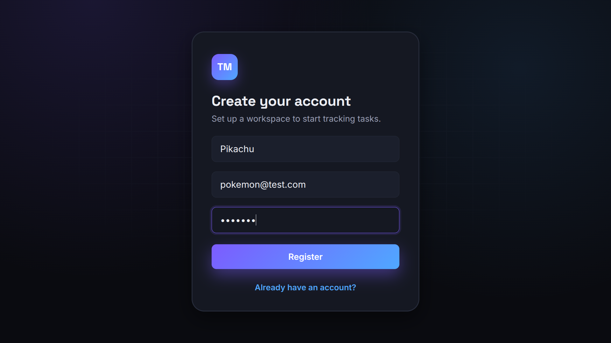
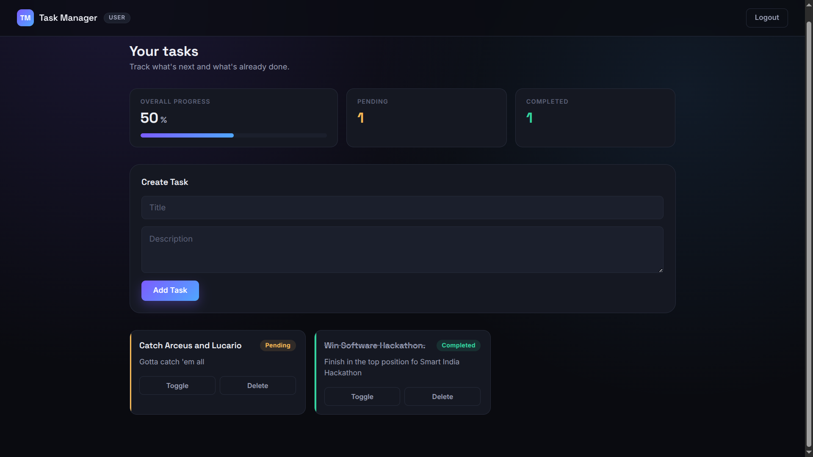
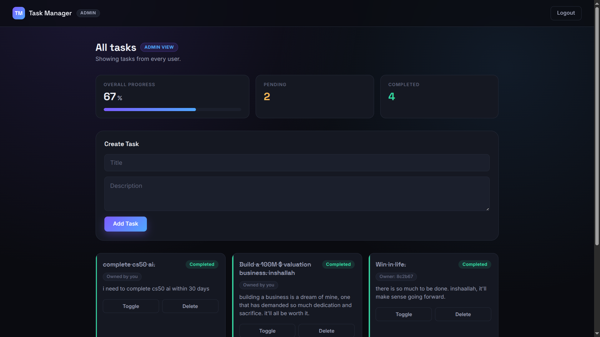
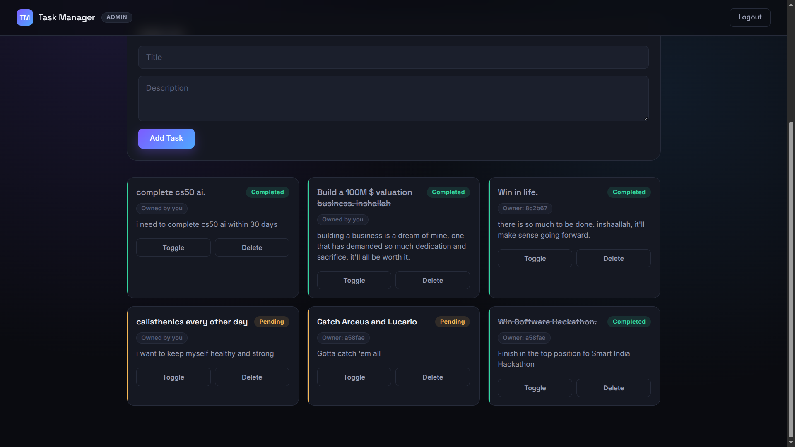
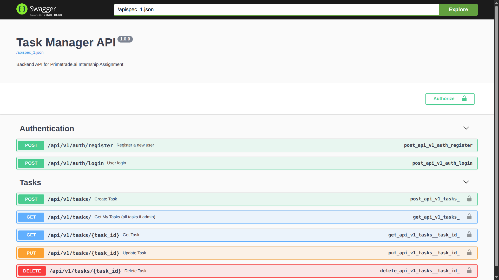
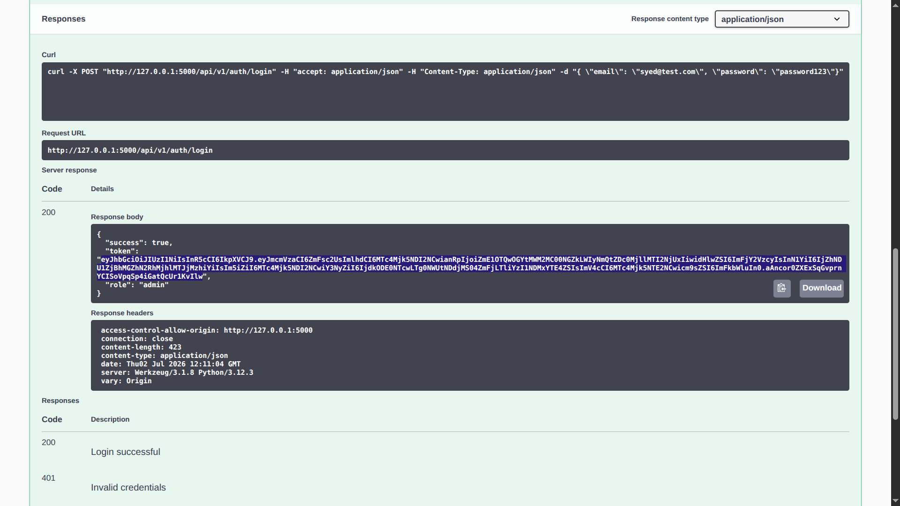
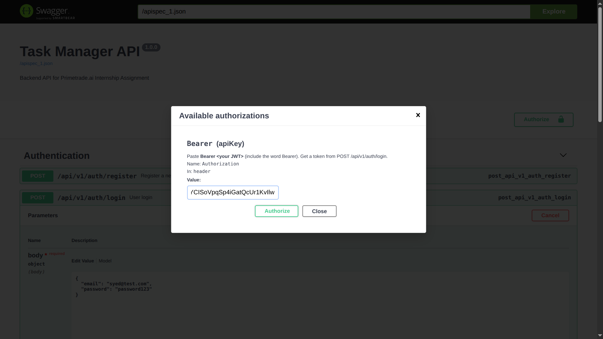
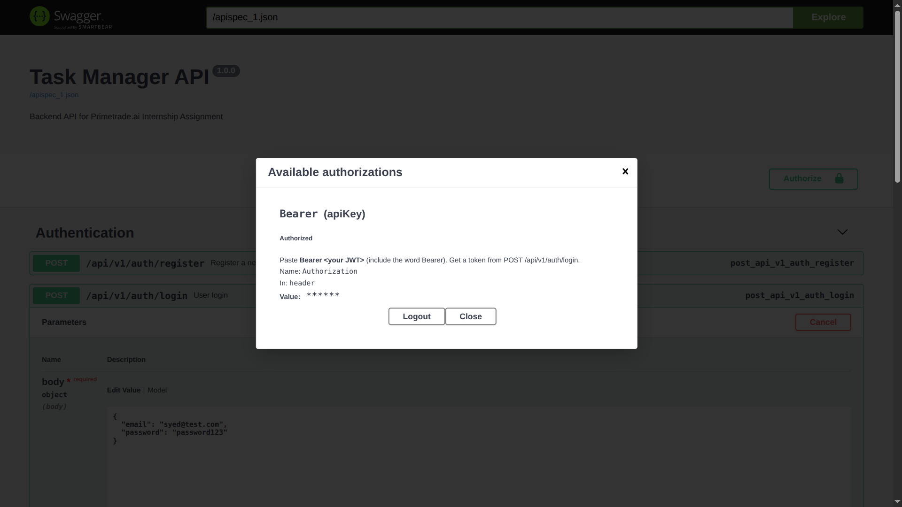

# Task Manager — AI Website Developer Intern Assignment (InAmigos Foundation)

A full-stack Task Manager built as a submission for the InAmigos foundation Task 3: a Flask + MongoDB REST API with JWT authentication and role-based access control, paired with a React (Vite) frontend for registering, logging in, and managing tasks.

## Overview

This project implements a scalable REST API with authentication and role-based access, plus a simple frontend to demonstrate it. This project also implements:

- Email/password registration and login with hashed passwords and JWT issuance
- Role-based access control distinguishing `user` and `admin`
- Full CRUD on a `tasks` entity, scoped to the owner unless the caller is an admin
- Versioned, documented REST API (`/api/v1/...`) with interactive Swagger docs
- A React dashboard that consumes the API end-to-end, including surfacing the admin/user distinction in the UI

## Tech Stack

**Backend**
- Flask (application factory pattern)
- Flask-PyMongo (MongoDB access)
- Flask-JWT-Extended (JWT issuance/verification)
- bcrypt (password hashing)
- Flasgger (Swagger/OpenAPI docs)
- python-dotenv (config)

**Frontend**
- React (Vite)
- React Router DOM
- Axios (with a request interceptor that attaches the JWT automatically)
- Plain CSS (custom design system, no UI framework)

**Database**
- MongoDB

## Features Implemented

### Authentication
- `POST /api/v1/auth/register` — creates a user with a bcrypt-hashed password, validates email format and password length, and rejects duplicate emails
- `POST /api/v1/auth/login` — verifies credentials and returns a JWT plus the user's role
- The JWT embeds the user's id (`sub`) and role (`role` claim), generated fresh at login so a role change takes effect on the next login

### Role-Based Access Control
- Regular users can only see, update, and delete their own tasks
- Admins can view, update, and delete **any** user's task
- Enforced server-side on every task route by checking the `role` claim from the JWT — not by trusting anything the client sends
- Reflected in the frontend: admins see an "Admin view" badge, a page heading that switches to "All tasks," and an owner indicator on tasks that aren't theirs

### Task CRUD
| Method | Endpoint              | Description                                  | Access             |
|--------|-----------------------|-----------------------------------------------|---------------------|
| POST   | `/api/v1/tasks/`      | Create a task                                 | Authenticated user  |
| GET    | `/api/v1/tasks/`      | List tasks (own tasks, or all tasks if admin) | Authenticated user  |
| GET    | `/api/v1/tasks/<id>`  | Get a single task                             | Owner or admin      |
| PUT    | `/api/v1/tasks/<id>`  | Update a task's title, description, or status | Owner or admin      |
| DELETE | `/api/v1/tasks/<id>`  | Delete a task                                 | Owner or admin      |

All task routes require `Authorization: Bearer <token>`.

### API Documentation
- Interactive Swagger UI at `/apidocs`, with a working **Authorize** button — paste `Bearer <token>` once and all protected endpoints become testable directly from the docs
- Endpoints are tagged and versioned under `/api/v1`

### Frontend
- Register / Login / Dashboard flow, with the JWT and role stored client-side after login
- Dashboard: create tasks, toggle completion, delete tasks, and (for admins) act on other users' tasks
- Axios interceptor attaches the bearer token to every request automatically
- Success/error messages surfaced from API responses (e.g. invalid credentials, duplicate email)

## Database Schema (MongoDB)

**`users`**
```json
{
  "_id": "ObjectId",
  "name": "string",
  "email": "string (unique, lowercased)",
  "password": "string (bcrypt hash)",
  "role": "user | admin",
  "created_at": "datetime"
}
```

**`tasks`**
```json
{
  "_id": "ObjectId",
  "title": "string",
  "description": "string",
  "completed": "boolean",
  "owner": "string (user _id)",
  "created_at": "datetime",
  "updated_at": "datetime"
}
```

## Project Structure

```text
Task-Manager/
├── backend/
│   ├── app.py                # application factory, blueprint registration
│   ├── config.py              # env-based configuration
│   ├── extensions.py          # Mongo, JWT, Swagger instances
│   ├── requirements.txt
│   ├── middleware/
│   │   └── auth.py            # admin_required decorator
│   ├── models/
│   │   ├── user.py
│   │   └── task.py
│   ├── routes/
│   │   ├── auth.py
│   │   └── tasks.py
│   └── utils/
│       └── validators.py
│
└── frontend/
    └── src/
        ├── pages/
        │   ├── Login.jsx
        │   ├── Register.jsx
        │   └── Dashboard.jsx
        ├── components/
        │   └── Navbar.jsx
        ├── services/
        │   └── api.js          # Axios instance + JWT interceptor
        ├── utils/
        │   └── auth.js         # reads role / decodes JWT client-side
        ├── App.jsx
        └── main.jsx
```

## Screenshots

### Login


### Register


### Dashboard — User view


### Dashboard — Admin view (all tasks, owner tags)




### Swagger Docs


### Swagger — Authorize (JWT Bearer auth)





## Setup

### Prerequisites

- Python 3.10+
- Node.js 18+
- MongoDB running locally or a MongoDB Atlas connection string

### MongoDB

The API needs a reachable MongoDB instance before it can serve any request that touches the database (including login/register).

**locally install MongoDB**
```bash
sudo systemctl start mongod
sudo systemctl status mongod   # confirm it's running
```

The `MONGO_URI` in `backend/.env` needs to point at wherever Mongo ends up running (`mongodb://localhost:27017/taskmanager` for a local/Docker instance).

If Mongo isn't reachable, the API now returns a clear `503 { "success": false, "message": "Database is currently unavailable. Please try again shortly." }` instead of a raw crash — see Security Practices below.

### Backend

```bash
cd backend
python -m venv venv
source venv/bin/activate      # Windows: venv\Scripts\activate
pip install -r requirements.txt
```

Create a `.env` file in `backend/`:

```env
MONGO_URI=your_mongodb_connection_string
JWT_SECRET_KEY=your_jwt_secret
```

Run the server:

```bash
python app.py
```

The API runs at `http://127.0.0.1:5000`, and Swagger docs are available at `http://127.0.0.1:5000/apidocs`.

### Frontend

```bash
cd frontend
npm install
npm run dev
```

The Axios base URL in `src/services/api.js` points at `http://127.0.0.1:5000/api/v1` — update this if the backend runs elsewhere.

### Creating an admin user

There's no admin signup flow by design — every new registration is a `user`. To test RBAC, register normally, then manually update that user's `role` to `"admin"` in MongoDB, and log in again (the role is baked into the JWT at login time, so an existing session won't pick up the change).

## Security Practices

- Passwords hashed with bcrypt, never stored or returned in plaintext
- JWT-based auth on every protected route (`@jwt_required()`), with custom handlers for missing, malformed, and expired tokens returning consistent JSON instead of default library errors
- Ownership checks on every task read/write, with an explicit admin bypass rather than an implicit one
- Server-side validation on registration (email format, password length) and on task create/update (title required and length-capped, description length-capped, `completed` must be a real boolean) — rejects bad input before it reaches the database instead of trusting the client
- Global error handling: invalid MongoDB ids, unknown routes, wrong HTTP methods, and unexpected server errors all return the same `{ "success": false, "message": "..." }` shape with the correct status code, instead of leaking stack traces. A database outage (e.g. MongoDB not running) is distinguished from a generic server error and returns `503` with a clear message, rather than an unhandled `500`.
- CORS enabled via Flask-CORS for the frontend origin

## API Health Check

```
GET /api/v1/health
```

Returns:
```json
{ "success": true, "status": "healthy", "version": "1.0.0" }
```

## Scalability Notes

- **Modular structure**: routes, models, and middleware are separated, so adding a new entity (e.g. `notes`, `projects`) means a new model + blueprint without touching existing code.
- **Stateless auth**: JWTs mean no server-side session store, so the API can scale horizontally behind a load balancer without sticky sessions.
- **Database**: MongoDB's document model suits tasks/users well at this scale; a natural next step under heavier load would be adding indexes on `tasks.owner` and `users.email`, and introducing pagination on `GET /tasks/` instead of returning the full collection.
- **Caching**: a read-heavy admin "all tasks" view is a reasonable candidate for a short-TTL Redis cache if task volume grows.
- **Deployment**: the app factory pattern in `app.py` makes it straightforward to containerize with Docker and run behind Gunicorn instead of the Flask dev server.

## Known Limitations / Next Steps

This was scoped and built as an assignment submission.A few nice-to-haves are intentionally left for future iteration:

- Owner information on admin-visible tasks is currently a raw user id, not a resolved name/email
- No automated test suite
- No Docker setup yet
- No caching layer (not needed at this scale; noted as a scalability option above)

## API Documentation

Swagger UI: `/apidocs` (JWT-protected endpoints testable via the Authorize button).
A Postman collection can be generated by importing the Swagger JSON at `/apispec_1.json`.
